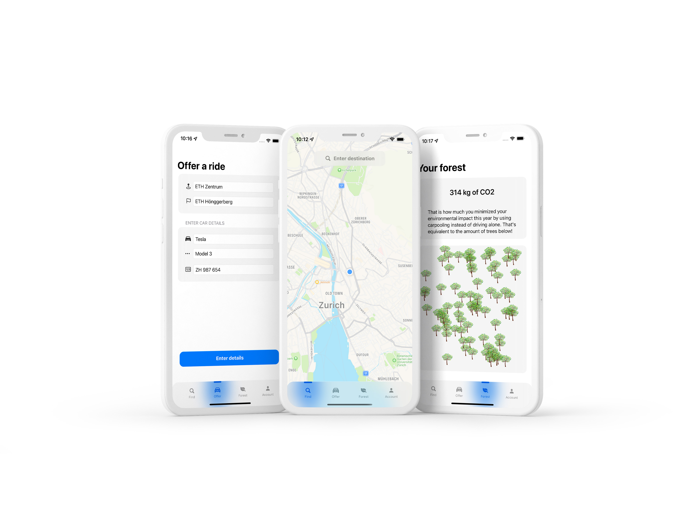

   &nbsp; &nbsp;
       

# Capstone Project - RideMates 

This capstone project was part of the Human Computer Interaction course at ETH Zurich during the fall semester of 2021. The project revolves around the development of a carpooling app tailored to the needs and preferences of users in Switzerland. It involves understanding local user concerns like safety, return trips, and trust to enhance the carpooling experience. The design process includes brainstorming sessions, development of low and mid-fidelity prototypes focusing on user verification and trust-building features, and consideration of social media integrations for user connections. The project aims to address user needs effectively through a user-centric approach, leveraging UX design principles.

   

## Carpooling Context 

  With evermore densely populated cities, crowded streets resulting in traffic jams and a desire for a more environmentally friendly and affordable transportation, carpooling seems to be the ultimate solution. Carpooling is the sharing of available seats in a car, which would normally be left empty. There exist many different carpooling platforms in many countries around the world, each with their own strengths and weaknesses. These platforms are leveraging the ubiquity of smartphones and readily available and unused seats in order to facilitate a peer-to-peer network allowing drivers to be connected to passengers. While it may seem like an obvious and easy solution, carpooling has not (yet) taken off in the ways it was predicted a few years ago. Especially in Switzerland, carpooling platforms seem to be non-existent. Concerns about safety, data privacy and security, costs, travel routes, pick-up and drop-off locations, rides back home and the lack of trust are some of the most critical categories for the success of carpooling platforms around the world. Network effects and consequently the needed awareness of existence of these platforms is another important factor in order to succeed. However, since carpooling is dependent on the local community, the importance of the aforementioned factors differs for each location (e.g. country). Since Switzerland is considered to be a safe country, the safety during carpooling is not the top priority of local users. Instead they worry more about ensuring a ride back home. This shows that a carpooling platform should focus increasingly on the issues and needs of the local community, which represents possible users of the platform’s services. By focusing more on the user’s needs and the user experience, we are trying to build a carpooling platform that enables everyone in Switzerland to get from A to B in a safe, affordable, convenient and environmentally friendly way.

